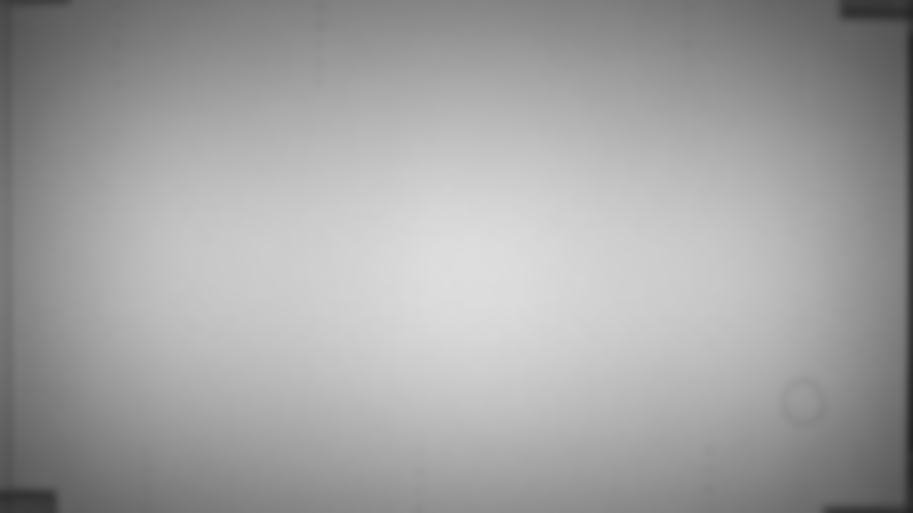

```@meta
CurrentModule = CounterMarking
```

# CounterMarking

[CounterMarking](https://github.com/HolyLab/CounterMarking.jl) analyzes experiments on [scent-marking in mice](https://www.sciencedirect.com/science/article/pii/S0003347287800167),
specifically images of urine countermarking visualized by the [ninhydrin reaction](https://pubs.acs.org/doi/full/10.1021/jf030490p):


The yellow spot corresponds to a stimulus provided by the experimenter, and the small light-blue spots are deposited marks.

Tips on image quality:

- Put the stimulus near one of the four corners, keeping its location as consistent as possible between images
- Ensure lighting is fairly uniform
- Make sure that any extraneous marks (e.g., the black writing in the image above) are of a very different color from scent marks.
- Ensure that all your images are of the same size (i.e., same number of pixels horizontally and vertically), even if there are some extra pixels on the edges of the image

## Tutorial

### Installation and setup (one time setup)

There are several ways to organize your data, but one recommended approach is to have a parent "project" folder, and then store images collected on different days in subfolders named by date:

```sh
MyCounterMarkingFolder
  Project.toml
  2025-03-15/
  2025-03-17/
  ...
```

We'll create the `Project.toml` for running the analysis. From the command line within `MyCounterMarkingFolder`, the steps below will:

- start Julia
- get into `pkg>` mode
- activate a new project
- install the packages you'll use

Here are the steps, starting from the OS command line:

```
MyCounterMarkingFolder$ julia
<banner shows up>

julia> ]    # this enters pkg mode
pkg> activate .

pkg> add CounterMarking ImageView Glob FileIO ImageIO
```

This should create the `Project.toml` file in `MyCounterMarkingFolder`. If this succeeds, you shouldn't have to do this again.


From this point on, start Julia like this:

```sh
MyCounterMarkingFolder$ julia --project
```

and it will automatically "activate" this project and you'll have access to all those packages.

!!! tip
    If you ever need to update the packages (e.g., to get any improvements
    to `CounterMarking.jl`), you can update packages with `pkg> up`. See the
    [Pkg documentation](https://pkgdocs.julialang.org/v1/getting-started/) for
    more information.

## Processing data with the GUI

### Running the GUI

From within `MyCounterMarkingFolder` created above, start Julia like this:

```sh
MyCounterMarkingFolder$ julia --project
```

Then load the packages:

```
julia> using CounterMarking, Glob
```

Then specify the images you want to process:

```
julia> gui("results_file_name", glob"Picture*.png")
```

This will save your results to `"results_file_name.xlsx"` and `"results_file_name.jld2"`.
The syntax `glob"pattern"` means "all files that match this pattern", where `*` means "one or more characters".
See [this tutorial](https://www.malikbrowne.com/blog/a-beginners-guide-glob-patterns/) for more information about glob syntax.
Alternatively, you can supply a list of files:

```
julia> gui("results_file_name", ["PictureA.png", "mouse7.png"])
```

Additionally, you can supply a calibration image to improve segmentation by correcting for uneven illumination.



```
julia> gui("results_file_name", ["PictureA.png", "mouse7.png"]; background_path="calibration_image.png")
```

However you launch it, you should see something like this:


On the top is the raw image. On the bottom is the segmented image; you should visually compare the two to check whether you're pleased with the quality of the segmentation.

If the default segmentation doesn't look quite right, try adjusting the Color Similarity Threshold value using the buttons at the bottom of the GUI.
(If you can't obtain a segmentation that you're happy with, click "Skip" to omit that file from analysis.)

If you like the segmentation, your tasks are:
- click on all the checkboxes with colors that correspond to urine spots. You'll notice that the stimulus spot is pre-clicked (you can correct its choice if it didn't pick correctly). Most of the time there will be only one you need to check, but you can click more than one.
  In this example image, all the urine spots are marked red, so you'd check the box that has the red border. Leave the stimulus spot checked, too.
- click "Done & Next" to advance to the next image in the sequence

After it finishes cycling through all the images, it will save your results and close the window.

### Summarizing the results: create a "density map" of marks across multiple images

If you have many images collected under the same conditions (e.g., with
different subject animals but the same stimuli), you can effectively overlay the
entire collection of images. For this demo, it's assumed that `"results_file_name.jld2"` is one of the files output by the GUI.

```
julia> using CounterMarking, ImageView   # load packages (if this is a fresh session)

julia> count = density_map("results_file_name.jld2");

julia> dct = imshow(dmap);
```

!!! tip
    `density_map` requires that most or all of your images are of the same size.

## Processing manually

### Step 1: start Julia with the right project

From within `MyCounterMarkingFolder` created above, start Julia like this:

```sh
MyCounterMarkingFolder$ julia --project
```

### Step 2: load the packages you'll need

From inside Julia, load the packages:

```
julia> using CounterMarking, ImageView, FileIO
```

CounterMarking is this package, used to perform and organize the analysis.
[ImageView](https://github.com/JuliaImages/ImageView.jl) is an image display tool.
[FileIO](https://github.com/JuliaIO/FileIO.jl) loads many different file formats, including images.

### Step 3: load a test image

If you want to use an image in one of the subfolders, use something like

```
julia> img = load("2025-03-15/picture1.png");
```

You'll need to replace the material inside quotes with the actual path and filename of your image.

Alternately, if you want to use the test image that comes with CounterMarking.jl, do the following:

```
julia> img = load(joinpath(pkgdir(CounterMarking), "docs", "src", "assets", "Picture.png"));
```

### Step 4: visualize the image

It's usually a good idea to visually check that what you're working with makes sense:

```
julia> dct = imshow(img);
```

Note that as you move your mouse cursor over the image, a little text box in the lower left updates with the position and information about the color of the pixel under your cursor.
That can occasionally be handy, especially for checking locations of spots.

If all looks as expected, you can close the window.

### Step 5: segment the image

We'll split this image into different regions:

```
julia> seg = segment_image(img)
Pruning segments smaller than 50 pixels
Segmented Image with:
  labels map: 1220×2441 Matrix{Int64}
  number of labels: 153

julia> dct = randshow(img, seg);
```

After the second command, [`randshow`](@ref), you'll see two images: the original at the top, and the "segmented" image below. This displays the different segments (regions) using a randomly-chosen color, which can be handy for checking how well the analysis did in identifying separate spots. You can alternatively use [`meanshow`](@ref) to show each segment using the average color of all pixels in that segment.

If you Ctrl-click and drag on the image, you'll zoom in on both images. This can be handy for inspecting fine details. Ctrl-double-click takes you back to the full view.

!!! tip
    If you don't like how [`segment_image`](@ref) performed, read its documentation to learn about some of the options you have for controlling it.

### Step 6: save the spots to an Excel file

The columns marked "raw" correspond to pixel locations in the original image; the columns marked "UL" come from flipping the image to place the stimulus spot in the Upper Left of the image.
This way of "standardizing" the location makes certain analyses easier.

```
julia> writexlsx("mydata.xlsx", seg)
```

Optionally specify a full directory path, e.g.,

```
julia> writexlsx(raw"C:\Users\me\somefolder\mydata.xlsx", seg)
```

(You don't need `raw` on Linux or Mac, but it is helpful on Windows.)

### Step 7: process a whole directory of images at once

If you have many images in one folder, you can process them all using a single command:

```
julia> process_images("2025-03-15/results.xlsx", "2025-03-15/*.png")
```
